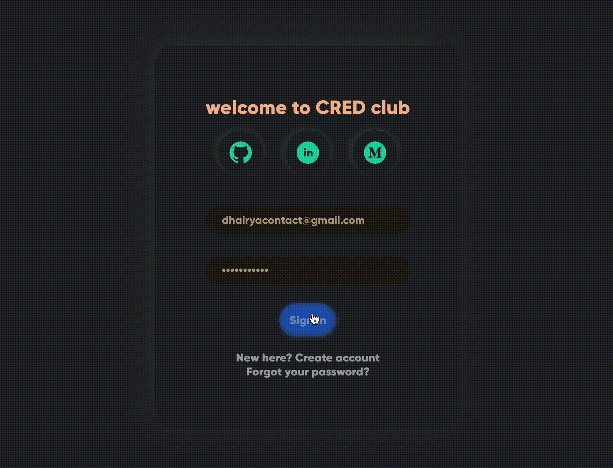

## CRED-Login

### What if you could login to CRED from your desktop...

React based login application depicting CRED Neomorphic like UI usage built with React, JavaScript, HTML and CSS

## Project Screen Shot(s)

## Installation and Setup Instructions

Follow the instructions:

1. Clone the project using `git clone https://github.com/dhairyaostwal/CRED-Login.git`
2. Open the project. You will need `node` and `npm` installed globally on your machine.  
3. `npm i` 
4. `npm start`
5. To Visit App: `localhost:3000/ideas`  

## Before you leave 🥺

Hey! I am Dhairya Ostwal, a CSE undergrad from India. I mainly work on frontend web development and love building innovative products. Presently serving as a Frontend Developer at [@onTribe](www.ontribe.in).

🌱 Previously served as a Business Development Intern in a legal-tech startup driving Pre-Sales & Expansion. So, you can also call me *a **Business Dev turned Developer*** 👨🏻‍💻

Let's connect on 

  

**Star the repo ⭐️ if you like 😄**
